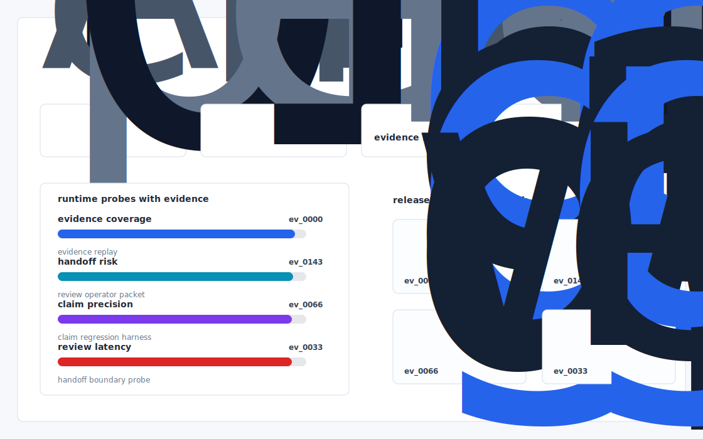
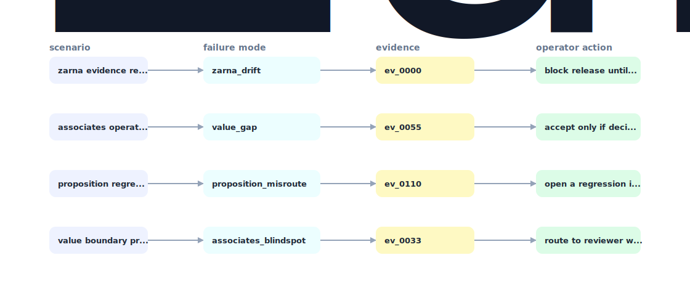

# Firmprint

An open source tool that ingests a fund's historical memo and deal-review corpus and emits a machine readable "firm profile" - screening criteria, IC memo style guide, decision bias matrix - that drops directly into Zarna's Analyst and Memo agents as a system prompt + few shot bundle.



## Why it exists

Zarna's value proposition is "AI associates tuned to your firm's evaluation methods, decision making patterns, and institutional knowledge" (zarnaai.com).

Most internal demos stop at a pretty chart. This repository is built around the harder part: a repeatable path from fixture, to failure, to evidence, to the operator action a serious team would actually trust.

## What is inside

- A deterministic replay harness tuned around zarna, value, and proposition.
- Company-specific strategy code in `src/firmprint/strategy.py`, not just README-level customization.
- Citation-locked reports where every decision claim has to point back to a generated evidence ID.
- Two visual artifacts generated from the latest run: `outputs/project_working.svg` and `outputs/evidence_map.svg`.
- A portable demo pack with JSON, CSV, Markdown, HTML, SVG, and benchmark artifacts.



## Signals it measures

- `zarna coverage`
- `value risk`
- `proposition precision`
- `associates latency`

## Failure modes it plants

- zarna drift
- value gap
- proposition misroute
- associates blindspot

## Run it locally

```bash
uv sync
uv run firmprint all
uv run pytest -q
uv run ruff check .
```

## Outputs worth opening

- `outputs/dashboard.html`
- `outputs/project_working.svg`
- `outputs/evidence_map.svg`
- `outputs/operator_brief.md`
- `outputs/decision_report.md`
- `outputs/strategy_model.json`
- `outputs/demo_pack.zip`

## Sources

- https://www.ycombinator.com/companies/zarna
- https://www.linkedin.com/posts/rishabh-dhariwal_grateful-to-share-that-zarna-yc-f25-is-activity-7376677228031455232-v64j
- https://www.zarnaai.com/team/rishabh
- https://www.crunchbase.com/person/vivan-agrawal
- https://www.crunchbase.com/person/rakesh-mehta-bd61
- https://www.crunchbase.com/organization/zarna
- https://www.alternates.ai/finance-and-operations/agent/zarna

## Boundary

Everything runs locally against synthetic fixtures. There are no credentials, no customer records, no outreach files, and no hosted API dependency.
